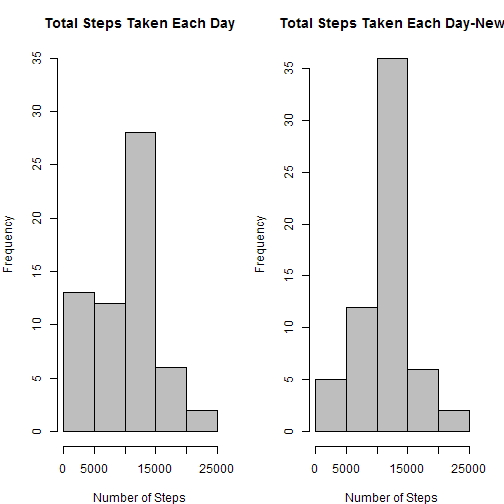

#Peer Assignment 1   - Data Analysis Report on Personal Movement

##I.Loading and preprocessing the data

```r
rm(list=ls())
library(ggplot2)
##my computer has different locale that can affect the results.
Sys.setlocale(category = "LC_ALL", locale = "US")
##read data
raw<-read.csv("activity.csv")

##processing data

raw$date<-as.Date(raw$date)
```


##II. What is mean total number of steps taken per day?

1.Calculate the total number of steps taken per day


```r
##aggregate day total steps and remove na values.
df<-aggregate(raw$steps,by=list(date=raw$date),sum,na.rm=T)
```

2.Make a histogram of the total number of steps taken each day

```r
names(df)[2]<-"steps"
par(mar=c(4,4,3,2),mfrow=c(1,1))
hist(df$steps,main="Total Steps Taken Each Day",
     xlab="Number of Steps",col="grey")
```

 


3.Calculate and report the mean and median of the total number of steps taken per day


```r
mean<-mean(df$steps)
median<-median(df$steps)
```
The mean of total number of steps taken per day is 9354.2295082, and the median is 10395.


##III.What is the average daily activity pattern?

1.Make a time series plot (i.e. type = "l") of the 5-minute interval (x-axis) and the average number of steps taken, averaged across all days (y-axis)

```r
##aggregate averaged steps taken per interval accross all days.removing NAs 
df2<-aggregate(raw$steps,by=list(interval=raw$interval),mean,na.rm=T)
names(df2)[2]<-"steps"

plot(df2$interval,df2$steps,type="l",col="navy",
     main="average steps taken per interval",
     xlab="Interval",ylab="Steps")
```

 

2.Which 5-minute interval, on average across all the days in the dataset, contains the maximum number of steps?


```r
max<-df2$interval[which.max(df2$steps)]
```
The interval contains the maximum averaged number of steps is the 5mins starts from 835.


##IV. Imputing missing values

Note that there are a number of days/intervals where there are missing values (coded as NA). The presence of missing days may introduce bias into some calculations or summaries of the data.

1.Calculate and report the total number of missing values in the dataset (i.e. the total number of rows with NAs)


```r
## the result is hidden and shown below using `r NA.count`
NA.count<-sum(is.na(raw$steps))
```
The total number of rows with NAs is **2304**

2. Use the interval mean as the missing value sustitution and fill them in.

```r
##change interval mean steps to integer.
df2$step2<-round(df2$steps)
```

3. Create a new dataset and fill in with interval mean matches.


```r
newdf<-raw
##apply the interval average to each NA that match its interval.
for (i in 1:nrow(newdf)){
        if (is.na(newdf$steps[i])){
      newdf$steps[i]<-df2[which(df2$interval==newdf$interval[i]),"step2"]        
      }
}
```

4
4.1 Make a histogram of the total number of steps taken each day  

```r
##aggregate day total steps and remove na values.
df3<-aggregate(newdf$steps,by=list(date=newdf$date),sum)
names(df3)[2]<-"steps"
par(mar=c(4,4,3,2),mfrow=c(1,2))

hist(df$steps,main="Total Steps Taken Each Day",
     xlab="Number of Steps",col="grey",ylim=c(0,35))
hist(df3$steps,main="Total Steps Taken Each Day-New",
     xlab="Number of Steps",col="grey")
```

 


4.2 Calculate and report the mean and median total number of steps taken per day. 


```r
mean2<-mean(df3$steps)
median2<-median(df3$steps)
diffMean<-mean2-mean
diffMedian<-median2-median
```
The mean of new dataset is **1.0765639 &times; 10<sup>4</sup>** , median is **1.0762 &times; 10<sup>4</sup>**

4.3
Do these values differ from the estimates from the first part of the assignment?What is the impact of imputing missing data on the estimates of the total daily number of steps?

Answer:Yes. The imputing of missing data makes the days with below 5000 steps decreased (since those days is counted as 0 for NA value), on the
contrary, the 10000-15000 days increased, since the average is slightly above 10,000 , so this group represents the center of this data.

The mean increased by **1411.4098361** steps per day, while the median
increased by **367** steps per day.


##V. Are there differences in activity patterns between weekdays and weekends?

Create a new factor variable in the dataset with two levels - "weekday" and "weekend" indicating whether a given date is a weekday or weekend day.


```r
##change data to date format
newdf$date<-as.Date(as.character(newdf$date))
newdf$weekday<-sapply(newdf$date,weekdays)

##add weekend or weekday column
weekend<-factor(levels=c("weekday","weekend"))
for (i in 1:nrow(newdf)){
        if (newdf$weekday[i]=="Saturday"|newdf$weekday[i]=="Sunday"){
                weekend[i]<-"weekend"
        }else{
                weekend[i]<-"weekday"                        
        }
}
newdf$weekend<-weekend
```


Make a panel plot containing a time series plot (i.e. type = "l") of the 5-minute interval (x-axis) and the average number of steps taken, averaged across all weekday days or weekend days (y-axis). 


```r
##split into two data.frame for plotting respectively

wd<-newdf[newdf$weekend=="weekday",]
we<-newdf[newdf$weekend=="weekend",]

## aggreagate steps by interval 
wd2<-aggregate(wd$steps,by=list(interval=wd$interval),mean)
names(wd2)[2]<-"steps"

we2<-aggregate(we$steps,by=list(interval=we$interval),mean)
names(we2)[2]<-"steps"

##plotting using base graphics
par(mfrow=c(2,1),mar=c(1,4,2,1))
plot(wd2$interval,wd2$steps,type="l",col="navy",
     main="average steps taken per interval on weekdays",
     xlab="Interval",ylab="Steps",ylim=c(0,250))
plot(we2$interval,we2$steps,type="l",col="red",
     main="average steps taken per interval on weekends",
     xlab="Interval",ylab="Steps",ylim=c(0,250))
```

 

As the plots shows, there is difference between average interval steps on weekend and weekdays.

Weekend have more "flat" distribution of the steps than weekdays.

Weekhas the peak hour around 8:00-9:00 period.(remember the max value is at 835-840 period) This may due to the rush hour for commuting. While weekend have no very obvious "peak hours".

Here I finish my peer assignments 1, and if you are still with me, I must say a big thanks to you for your reviewing of my work and report.

Thank you.


